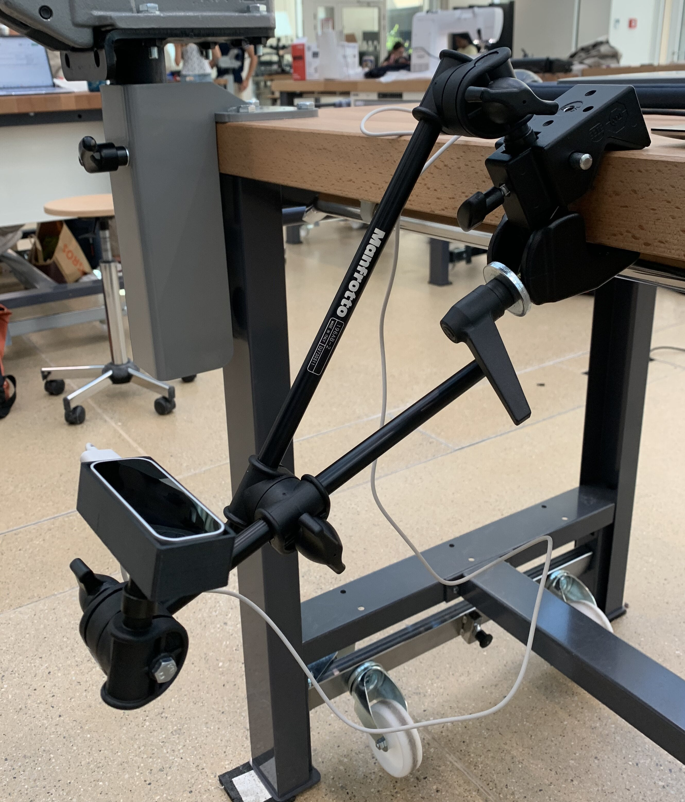

# Development of human-machine interface based on detection of fingers movements

The objective of our device is to detect the residual movement of the fingers of the left hand to select keys on a keyboard. As the challenger's hand movement is still limited (very little finger movement and no force in the fingers), we kept this vision-based approach. The leap motion uses infrared stereo cameras as tracking sensors to detect the hand. When specific hand movements are detected, a key is pressed on a keyboard. 

# Prerequisites

Windows
Python 3.7  
OrionV4: https://developer.leapmotion.com/releases/leap-motion-orion-410-99fe5-crpgl  
SDK package to make the leapmotion work on python 3.7 (Already in the github folder) 
Ananconda is recomended  
The packages required are :  
- PyQt5 
- Numpy
- Open-cv
- configparser
- pywin32
- pygame
- subprocess.run
- pynput
- Pillow
- ctypes-callable
- tkintertable
- AST
- pyttsx3
- gtts

# Installation
- Install OrionV4 using this link: https://developer.leapmotion.com/releases/leap-motion-orion-410-99fe5-crpgl  
- Install Anaconda
- Create a new environment with python 3.7 using Anaconda: conda create --name myenv python=3.7 (to get python3.7)  
- Activate your environment using: conda activate myenv  
- Install all the required libraries:  
`pip install -U numpy opencv-python configparser pywin32 pygame subprocess.run pynput Pillow ctypes-callable tkintertable PyQt5 pyttsx3 gtts`.  
- Install AST library using this command:
`conda install -c conda-forge typed-ast`
- Clone the code from github link :  
git clone: https://github.com/brahimrejeb/LeapOrion.git. 
Modify in the config.ini file the variable path_leap_folder with your own (if needed)  
- Run the script:  
python hand2keyPressedRehab.py  
# Convert to exe file

It is possible to convert this python code into a .exe file to make it more pleasant to use. 
- Switch to the new virtual environment, than type : 
`pip install pyinstaller`
- Go inside the right folder (`LeapOrion/hand2keyPressedRehab-master`)
- run the command : `pyinstaller --onefile -w hand2keyPressedRehab.py`
- The executable can be find into the dist folder, please put it one folder backward (copy paste it in hand2keyPressedRehab-master) to have access to all the dependecies. 
You can also follow this tutorial for that : [a link](https://www.youtube.com/watch?v=UZX5kH72Yx4)
# How to do the installation and create the executable file in one step 
- Install NSIS application from the web 
- Compress the LeapOrion folder
- On the NSIS menu: click on `install based on .ZIP file`
- Select the compressed folder (`LeapOrion`)
- Click on `Generate`
- An application will be generated on your folder, you can send this application to an other computer and open it then it will install all the folders and the dependencies and make it work on the new computer even if python is not installed. 

You can also follow this tutorial for that : [a link](https://www.youtube.com/watch?v=UZX5kH72Yx4)
# How it works :  
Leapmotion allows to measure the position in space of many specific points in the hand. We will use those measures to detect some specific movement. 

  

  

