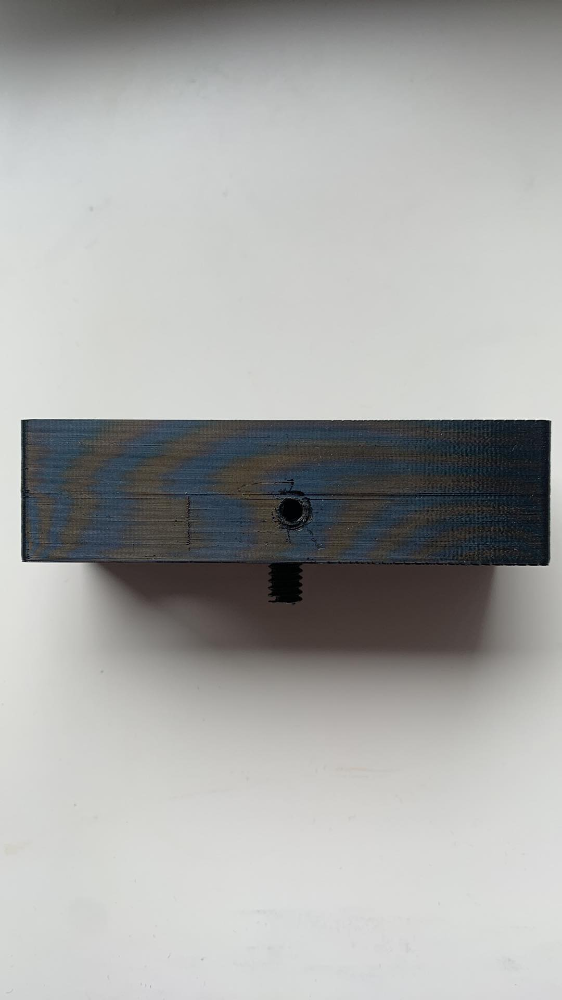
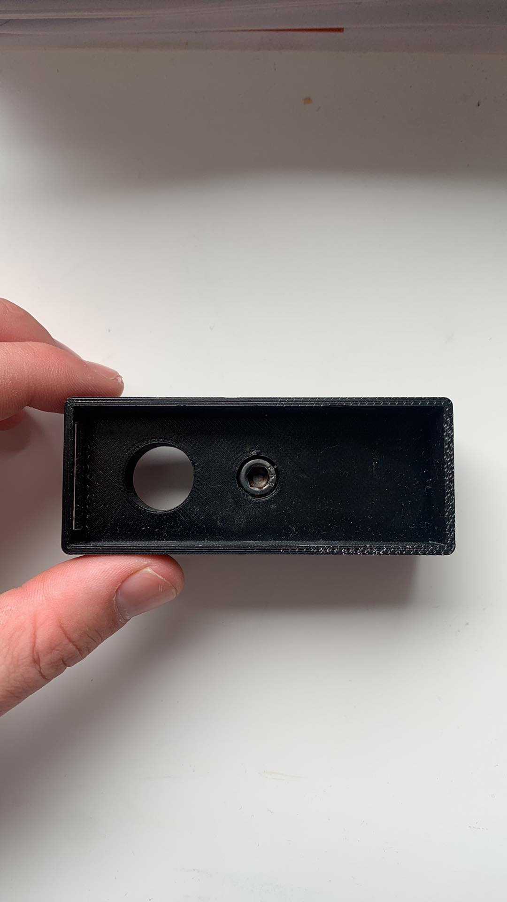

# CAD files and drilling directives 
The file is given in .f3d, .stl and .3mf format.
Note that it the original file was created with Autodesk Fusion 360.

## Drilling
the socket head cap screw does not stop turning and loses its grip after the fixation of the support so a 'headless' screw (Hex socket screw with flat point BN 24) is used to fix it. The hole is drilled as shown in the image below 

  
  

  
